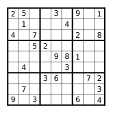

.. Sudoku (SciPy 2010) documentation master file, created by
   sphinx-quickstart on Thu Apr 15 10:56:06 2010.
   You can adapt this file completely to your liking, but it should at least
   contain the root `toctree` directive.

sudoku.py - Tutorial
====================

.. toctree::
   :maxdepth: 2

Puzzles
~~~~~~~

   Figure 1. A Sudoku puzzle.

Puzzle dictionaries
~~~~~~~~~~~~~~~~~~~

Sudoku puzzles can be represented by dictionaries, mapping cell labels (cells are labeled :math:`$1,\ldots,n^4$` left to right along rows, starting at the top-left) to values. 

So, for example, the puzzle in the above figure is represented by the following dictionary. ::

    >>> d = {1: 2, 2: 5, 5: 3, 7: 9, 9: 1,
    ...     11: 1, 15: 4, 19: 4, 21: 7, 25: 2,
    ...     27: 8, 30: 5, 31: 2, 41: 9, 42: 8,
    ...     43: 1, 47: 4, 51: 3, 58: 3, 59: 6,
    ...     62: 7, 63: 2, 65: 7, 72: 3, 73: 9,
    ...     75: 3, 79: 6, 81: 4}

Puzzle strings
~~~~~~~~~~~~~~

A Sudoku puzzle can be represented by a string where empty cells are given by periods. ::   

    >>> s = """
    ...     2 5 . . 3 . 9 . 1
    ...     . 1 . . . 4 . . .
    ...     4 . 7 . . . 2 . 8
    ...     . . 5 2 . . . . .
    ...     . . . . 9 8 1 . .
    ...     . 4 . . . 3 . . .
    ...     . . . 3 6 . . 7 2
    ...     . 7 . . . . . . 3
    ...     9 . 3 . . . 6 . 4
            """

Puzzle objects 
~~~~~~~~~~~~~~

Sudoku ``Puzzle`` objects can be built from dictionaries or strings. In either case, the boxsize of the puzzle must be supplied as a parameter to the constructor. ::

    >>> import sudoku
    >>> p = sudoku.Puzzle(d, 3)
    >>> p
     2  5  .  .  3  .  9  .  1 
     .  1  .  .  .  4  .  .  . 
     4  .  7  .  .  .  2  .  8 
     .  .  5  2  .  .  .  .  . 
     .  .  .  .  9  8  1  .  . 
     .  4  .  .  .  3  .  .  . 
     .  .  .  3  6  .  .  7  2 
     .  7  .  .  .  .  .  .  3 
     9  .  3  .  .  .  6  .  4        

To construct a ``Puzzle`` object from such a string, provide the keyword argument ``format = 's'`` to the constructor. Whitespace in the string is ignored. ::

    >>> p = sudoku.Puzzle(s, 3, format = 's')
    >>> p
     2  5  .  .  3  .  9  .  1 
     .  1  .  .  .  4  .  .  . 
     4  .  7  .  .  .  2  .  8 
     .  .  5  2  .  .  .  .  . 
     .  .  .  .  9  8  1  .  . 
     .  4  .  .  .  3  .  .  . 
     .  .  .  3  6  .  .  7  2 
     .  7  .  .  .  .  .  .  3 
     9  .  3  .  .  .  6  .  4 

Puzzle generators
~~~~~~~~~~~~~~~~~

To generate a random puzzle, use the ``random_puzzle`` function. The first argument specifies the number of clues. ::

    >>> q = sudoku.random_puzzle(15, 3)
    >>> q
     .  .  .  .  .  .  3  .  . 
     .  .  .  3  .  .  .  8  7 
     .  .  .  9  .  .  .  5  . 
     .  .  .  .  .  .  .  .  . 
     .  .  .  .  .  .  .  .  6 
     .  .  .  5  .  .  .  .  . 
     7  .  .  8  .  .  .  .  . 
     .  .  .  .  .  3  4  7  . 
     .  .  .  7  .  9  .  .  .    

Puzzle solving
~~~~~~~~~~~~~~~~~~~~~~~~~
::

    >>> sudoku.solve(q, 3)
     9  8  1  6  5  7  3  4  2 
     5  4  6  3  2  1  9  8  7 
     3  7  2  9  8  4  6  5  1 
     8  1  3  4  7  6  5  2  9 
     4  2  5  1  9  8  7  3  6 
     6  9  7  5  3  2  8  1  4 
     7  6  4  8  1  5  2  9  3 
     1  5  9  2  6  3  4  7  8 
     2  3  8  7  4  9  1  6  5

